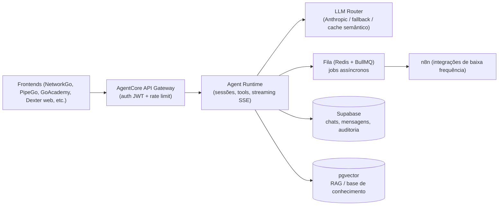

# 🧠 AgentCore — Especificação Técnica

> Backend estruturado para o super agente de IA da GoWork (**Dexter**).
> Runtime de alta frequência para chat síncrono, tirando o hot path do n8n.

- **Status:** 🟢 Em produção (v1.4.0)
- **Owner:** Luis Cuba (Sistemas)
- **Tarefa Notion:** [IA | AgentCore](https://app.notion.com/p/3b1c3598383a8160b440ffb52afe557d)
- **Última atualização:** 2026-08-05

---

## 1. Contexto e problema

O n8n hoje roda os fluxos de chat dos agentes (`dexter-company-chat`). Isso não escala porque:

- Chat é **síncrono e de longa duração** (streaming token a token) → ocupa um worker do n8n por dezenas de segundos por conversa.
- Não há **controle fino de concorrência**, rate limiting por usuário/tenant, nem retry idempotente por requisição.
- Histórico de conversa e memória de agente **não são responsabilidade de um orquestrador de workflows**.
- Escalar n8n em cluster (queue mode + Redis + workers) resolve throughput de *workflows*, **não latência de *chat*** — e acopla toda a operação de IA à disponibilidade do n8n.

### Decisão de arquitetura

> **n8n permanece** para webhooks de integração (HubSpot, Notion, Omie, e-mail via SES) e jobs agendados.
> **Todo tráfego de chat/agente passa pelo AgentCore.**

---

## 2. Agente atendido

| Agente | Canal | Auth | Público |
|--------|-------|------|---------|
| **Dexter** | Frontends (NetworkGo, PipeGo, GoAcademy, Dexter web, etc.) | JWT Supabase Auth | Interno |

---

## 3. Arquitetura proposta



### 3.1 Componentes

| # | Componente | Stack (proposta) | Responsabilidade |
|---|-----------|------------------|------------------|
| 1 | **API Gateway** | Node.js (Fastify) atrás de proxy | Auth (JWT Supabase do Dexter), rate limit (sliding window Redis), CORS restrito |
| 2 | **Agent Runtime** | Fastify + SSE | Sessão, montagem de contexto (histórico + RAG + tools), chamada ao LLM com streaming. **Stateless** |
| 3 | **LLM Router** | LiteLLM ou próprio | Roteamento por custo/tarefa, retry+backoff, fallback entre provedores, cache semântico |
| 4 | **Fila assíncrona** | Redis + BullMQ | Jobs sem resposta imediata: OTP, sumarização, embeddings, notificações. Retry + DLQ |
| 5 | **Persistência** | Supabase Postgres + pgvector | `agent_chats`, `agent_messages`, `agent_tool_calls`, `agent_feedback`. RLS por usuário |
| 6 | **Observabilidade** | logs estruturados + GoDash/NOC | `trace_id`, latência p50/p95, custo por conversa, taxa de fallback |

> ⚠️ **Decisão bloqueante (item de escopo 1):** Fastify em container **vs** edge functions.
> Edge functions do Supabase não sustentam bem SSE de longa duração nem sessões persistentes (limite de execução + cold start). Recomendação técnica: **Fastify em container para o hot path (gateway + runtime SSE)**; edge functions apenas para jobs curtos, se houver. Validar em revisão de SQL/segurança.

---

## 4. Escala e deploy

- Deploy em **containers no DigitalOcean** (Portainer já em uso) — 2+ réplicas do runtime atrás de load balancer.
- **Redis** gerenciado ou container dedicado com persistência.
- Runtime **stateless** → escala horizontal simples (adicionar réplica, sem sticky session; SSE compatível via LB com timeout ajustado).
- **Secrets centralizados no Infisical** (chaves de LLM, SMTP, service role Supabase).
- Health checks `/healthz` + restart automático; **circuit breaker** para provedores de LLM.
- **Meta de capacidade inicial:** 50 conversas simultâneas com **p95 < 3s até o primeiro token**.

---

## 5. Segurança (baseline obrigatório)

- ✅ **Nenhuma secret no frontend** — padrão já validado no GoTrainning (Worker como proxy).
- ✅ Toda tool call registrada em `agent_tool_calls` com input/output, usuário e timestamp (**auditoria LGPD**).
- ✅ Acesso ao banco pelos agentes **exclusivamente via RPCs read-only** com `SECURITY DEFINER` restrito — **nunca SQL livre gerado por LLM**.
- ✅ Guardrails de prompt: system prompt **versionado**, filtros de PII em logs, injection detection básica em inputs.
- ✅ **Revisão SQL/segurança obrigatória** em todas as RPCs e migrations.
- ⚠️ **Cache semântico:** threshold de similaridade alto + **escopo por tenant/usuário** para evitar vazamento de dado entre clientes.

---

## 6. Modelo de dados (rascunho)

> A detalhar e revisar (SQL/segurança) antes de qualquer migration.

```sql
-- agent_chats: uma sessão de conversa
-- agent_messages: mensagens (role, content, tokens_in, tokens_out)
-- agent_tool_calls: auditoria de tool calls (input, output, usuario, ts, trace_id)
-- agent_feedback: feedback do usuário sobre respostas
-- RLS por usuário/tenant em todas as tabelas
-- pgvector: base de conhecimento (embeddings / RAG)
```

*(Schema implementado — 32 migrations em `supabase/migrations/`; detalhe no repo.)*

---

## 7. Escopo (checklist)

- [x] Definir stack final — **Fastify em container** para hot path (SSE); edge functions descartadas para chat
- [x] Provisionar Redis e containers no DigitalOcean/Portainer — **Redis sobe no compose; BullMQ ainda não integrado**
- [x] Implementar gateway (auth JWT Supabase, rate limit global, CORS)
- [x] Implementar runtime com streaming SSE e gestão de sessão (persistência em `agent_chats` / `agent_messages`)
- [x] Implementar LLM Router multi-provider (Anthropic, OpenAI, Gemini, DeepSeek, xAI, Ollama) — **cache semântico pendente**
- [x] Criar schema Supabase com RLS — **32 migrations** (`agent_chats`, `agent_messages`, `agent_tool_calls`, projetos, artefatos, workflows, KB, admin, share, etc.)
- [ ] Migrar fluxos de chat existentes do n8n (`dexter-company-chat`) para o runtime — **Dexter web já no AgentCore; embeds NetworkGo/PipeGo/GoAcademy ainda parcialmente no n8n**
- [ ] Observabilidade: logs, métricas e painel no NOC/GoDash — **hoje só painel admin interno**
- [ ] Teste de carga (50 sessões simultâneas) e documentação técnica no padrão S&D
- [ ] Fila assíncrona BullMQ — **workflows usam timer in-process (`workflow-runner.ts`); Redis ocioso**

---

## 8. Faseamento sugerido

| Fase | Entrega | O que destrava |
|------|---------|----------------|
| **1 — MVP hot path** | Gateway (auth+rate limit) + Runtime SSE + 1 modelo, sem router/cache | Dexter respondendo fora do n8n |
| **2 — Persistência + auditoria** | Schema Supabase + RLS + `agent_tool_calls` (revisão de SQL/segurança) | Compliance LGPD |
| **3 — Router + fila** | LLM Router (fallback+cache) + BullMQ + DLQ | Economia de custo e jobs async |
| **4 — Escala + obs.** | 2+ réplicas + LB + painel NOC + teste de carga 50 sessões | Critério de aceite final |

**Estado atual (2026-08-05):** fases **1–3 entregues** (gateway, runtime SSE, schema, router multi-provider, 9 sistemas integrados via RPC, conectores OAuth, workflows in-process, admin). **Fase 4 parcial** — 1 réplica em prod, sem painel NOC nem teste de carga; BullMQ pendente.

---

## 9. Lacunas a resolver (backlog de decisões)

- [ ] **Migração/rollback** do `dexter-company-chat`: rodar em paralelo (n8n + AgentCore)? Feature flag por canal?
- [ ] **Gestão de contexto/memória**: janela de contexto, sumarização, política de retenção (LGPD).
- [ ] **Multi-tenancy**: RLS e isolamento por tenant desde o schema inicial.
- [ ] **Projeção de custo**: tokens/mês por agente → meta mensurável para o cache.
- [ ] **Acoplamento reverso `RT → Q → n8n`**: o que realmente precisa passar pelo n8n vs. resolver direto no worker BullMQ (ex.: e-mail via SES direto).
- [ ] **Definição de "primeiro token"** para o critério de p95 (o que conta: overhead interno vs. latência do provedor LLM).

---

## 10. Critérios de aceite

- [ ] Chat do Dexter respondendo via AgentCore com streaming, **sem passar pelo n8n no caminho síncrono**.
- [ ] **p95 < 3s até primeiro token** sob 50 sessões simultâneas.
- [ ] **Zero secrets em frontend**; **100% das tool calls auditadas**.
- [ ] n8n **sem workflows de chat de alta frequência** ativos.

---

## Changelog

- **2026-08-05** — Status atualizado para produção v1.4.0; checklist e faseamento alinhados ao código (32 migrations, 12 grupos de rotas, router multi-provider; pendências: BullMQ, cache semântico, load test, NOC, migração n8n parcial).
- **2026-08-03** — Especificação inicial criada a partir da tarefa do Notion + análise técnica.
